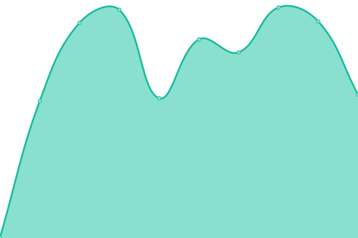
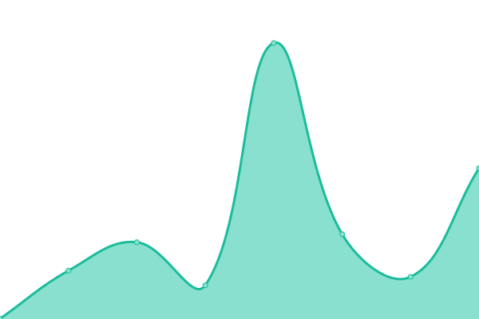

# [📈 Live Status](https://status.gnosispay.com): <!--live status--> **🟧 Partial outage**

This repository contains the open-source uptime monitor and status page for [Gnosis Chain](https://www.gnosischain.com/), powered by [Upptime](https://github.com/upptime/upptime).

With [Upptime](https://upptime.js.org), you can get your own unlimited and free uptime monitor and status page, powered entirely by a GitHub repository. We use [Issues](https://github.com/gnosischain/gnosispay-uptime/issues) as incident reports, [Actions](https://github.com/gnosischain/gnosispay-uptime/actions) as uptime monitors, and [Pages](https://status.gnosispay.com) for the status page.

<!--start: status pages-->
<!-- This summary is generated by Upptime (https://github.com/upptime/upptime) -->
<!-- Do not edit this manually, your changes will be overwritten -->
<!-- prettier-ignore -->
| URL | Status | History | Response Time | Uptime |
| --- | ------ | ------- | ------------- | ------ |
|  [GnosisPay](https://gnosispay.com/) | 🟩 Up | [gnosis-pay.yml](https://github.com/gnosischain/gnosispay-uptime/commits/HEAD/history/gnosis-pay.yml) | 

 357ms
     
 | 

<a href="https://status.gnosispay.com/history/gnosis-pay">100.00%</a>
    

|  [GnosisPay DEVNET RPC](https://rpc.devnet.gnosispay.network) | 🟥 Down | [gnosis-pay-devnet-rpc.yml](https://github.com/gnosischain/gnosispay-uptime/commits/HEAD/history/gnosis-pay-devnet-rpc.yml) | 

 0ms
     
 | 

<a href="https://status.gnosispay.com/history/gnosis-pay-devnet-rpc">0.00%</a>
    

|  [GnosisPay DEVNET Explorer](https://explorer.devnet.gnosispay.network) | 🟥 Down | [gnosis-pay-devnet-explorer.yml](https://github.com/gnosischain/gnosispay-uptime/commits/HEAD/history/gnosis-pay-devnet-explorer.yml) | 

 0ms
     
 | 

<a href="https://status.gnosispay.com/history/gnosis-pay-devnet-explorer">0.00%</a>
    

|  [GnosisPay TESTNET RPC](https://rpc.testnet.gnosispay.network) | 🟩 Up | [gnosis-pay-testnet-rpc.yml](https://github.com/gnosischain/gnosispay-uptime/commits/HEAD/history/gnosis-pay-testnet-rpc.yml) | 

 742ms
     
 | 

<a href="https://status.gnosispay.com/history/gnosis-pay-testnet-rpc">100.00%</a>
    

|  [GnosisPay TESTNET Explorer](https://explorer.testnet.gnosispay.network) | 🟥 Down | [gnosis-pay-testnet-explorer.yml](https://github.com/gnosischain/gnosispay-uptime/commits/HEAD/history/gnosis-pay-testnet-explorer.yml) | 

 578ms
     
 | 

<a href="https://status.gnosispay.com/history/gnosis-pay-testnet-explorer">98.86%</a>
    

|  [Bicocca Testnet RPC](https://rpc.bicoccachain.net/) | 🟥 Down | [bicocca-testnet-rpc.yml](https://github.com/gnosischain/gnosispay-uptime/commits/HEAD/history/bicocca-testnet-rpc.yml) | 

 0ms
     
 | 

<a href="https://status.gnosispay.com/history/bicocca-testnet-rpc">0.00%</a>
    

|  [Bicocca Testnet Blockscout Explorer](https://explorer.bicoccachain.net/) | 🟥 Down | [bicocca-testnet-blockscout-explorer.yml](https://github.com/gnosischain/gnosispay-uptime/commits/HEAD/history/bicocca-testnet-blockscout-explorer.yml) | 

 0ms
     
 | 

<a href="https://status.gnosispay.com/history/bicocca-testnet-blockscout-explorer">0.00%</a>
    

<!--end: status pages-->

[**Visit our status website →**](https://status.gnosispay.com)

## 📄 License

- Powered by: [Upptime](https://github.com/upptime/upptime)
- Code: [MIT](./LICENSE) © [Gnosis Chain](https://www.gnosischain.com/)
- Data in the `./history` directory: [Open Database License](https://opendatacommons.org/licenses/odbl/1-0/)
